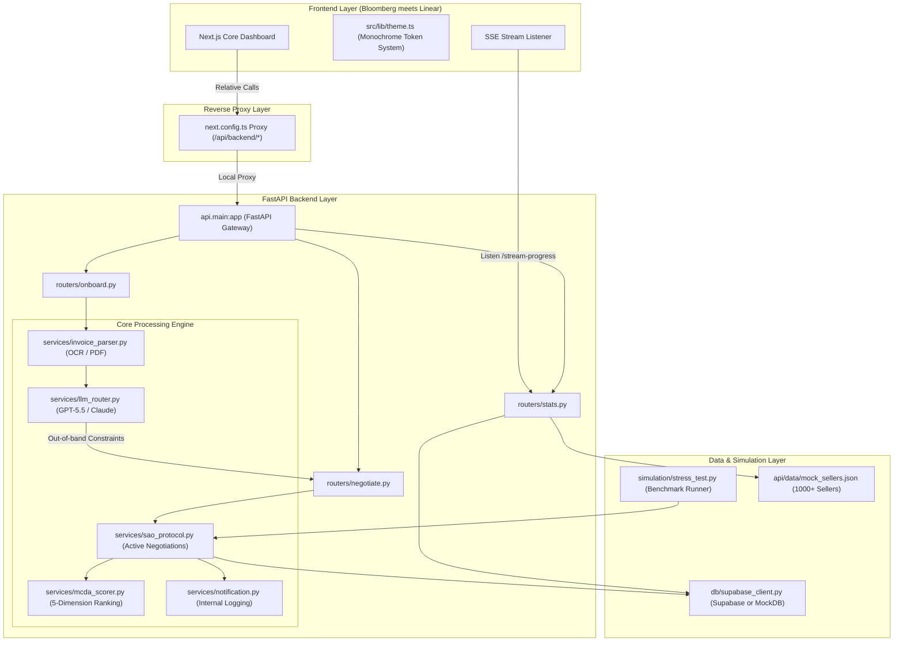
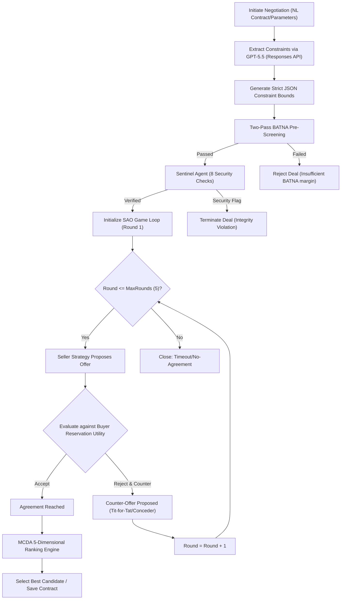

```
┌──────────────────────────────────────────────────────────────┐
│  ██████╗   █████╗   ██████╗  ████████╗                       │
│  ██╔══██╗ ██╔══██╗ ██╔════╝  ╚══██╔══╝                       │
│  ██████╔╝ ███████║ ██║          ██║                          │
│  ██╔═══╝  ██╔══██║ ██║          ██║                          │
│  ██║      ██║  ██║ ╚██████╗     ██║                          │
│  ╚═╝      ╚═╝  ╚═╝  ╚═════╝     ╚═╝                          │
│                                                              │
│  AUTONOMOUS AGENT-TO-AGENT B2B NEGOTIATION MARKETPLACE       │
│  High-Throughput SAO Engine • Institutional Gravity UI        │
└──────────────────────────────────────────────────────────────┘
```

# PACT — Autonomous A2A Negotiation Marketplace

PACT is an institutional-grade, high-performance autonomous Agent-to-Agent (A2A) B2B negotiation marketplace. Designed specifically for Indian MSMEs, PACT automates contract and price negotiations at massive scale, processing up to **28,530 negotiations per second** with **zero LLM cost per round** using a pure rule-based Strategic Negotiation (SAO) protocol.

The system is engineered as a monorepo consisting of a robust **FastAPI Backend** and a high-fidelity **Next.js Frontend** designed with the visual gravity of a Bloomberg Terminal combined with the sleek utility of Linear.app.

---

## ── System Architecture ──

The visual mapping of the system demonstrates the decoupling of user intent extraction, massive SAO parallel processing, and real-time frontend visualization:



---

## ── The Core Negotiation Loop ──

PACT avoids active LLM calls inside the negotiation round to ensure millisecond latencies. Instead, LLMs are used *strictly* for initial constraint extraction. The active negotiation uses the **Strategic Alternative Offer (SAO)** protocol:



---

## ── Design Doctrine & Visual tokens ──

PACT strictly follows the **Bloomberg Terminal meets Linear** doctrine. Sharing tokens exclusively from `src/lib/theme.ts`, the UI is governed by a strict monochrome environment:

### Color Value Tokens
| Token | HEX Value | Visual Representation | Purpose |
| :--- | :--- | :--- | :--- |
| **Base** | `#0A0A0A` | ⬛ `[ #0A0A0A ]` | Deep black workspace background |
| **Surface** | `#111111` | ⬛ `[ #111111 ]` | Component cards, terminal tables |
| **Border** | `#1E1E1E` | ⬛ `[ #1E1E1E ]` | Grid lines, high-contrast borders |
| **Text Primary** | `#F2F2F7` | ⬜ `[ #F2F2F7 ]` | High contrast labels & core readouts |
| **Text Secondary** | `#8E8E93` | ⬜ `[ #8E8E93 ]` | Secondary metrics, non-interactive labels |
| **Text Tertiary** | `#48484A` | ⬜ `[ #48484A ]` | Inactive states, metadata, timestamps |

### Spacing & Typography Rules
* **Grid**: Absolute `8px` base unit. All margins, padding, and gaps are strict multiples of 8.
* **Numbers**: Tabular-nums `Geist Mono` rendering to prevent numeric layout shifting during live streams.
* **Aesthetic Bounds**: Zero rounded UI elements (pills: `4px`, cards: `6px`), zero color accents, zero drop shadows (only flat `box-shadow 0 1px 3px rgba(0,0,0,0.4)`), zero decorative animations.

---

## ── Operational Features ──

### 1. 6 Seller Strategy Archetypes
Negotiation agents behaviorally align with one of these six deterministic archetypes:
* **Boulware**: Static, firm starting point. Extremely slow utility concessions.
* **Conceder**: Rapid early concessions, stabilizing as the deadline approaches.
* **Tit-For-Tat**: Concedes symmetrically in response to the buyer's prior utility step.
* **Hardball**: Zero concession until the final round to test buyer resilience.
* **Aspirational**: Begins with high margins, slowly decaying to target reservation values.
* **Realistic**: Linear, steady concessions tailored to real market bounds.

### 2. Multi-Criteria Decision Analysis (MCDA) Scoring
Every successful deal is weighed across a 5-dimension vector for optimal routing:

```
┌──────────────────────────────────────────────────────────────┐
│                    MCDA WEIGHT MATRIX                        │
├───────────────┬──────────────────────────────┬───────────────┤
│ Price         │ ▓▓▓▓▓▓▓▓▓▓▓▓▓▓▓▓             │ 40%           │
│ Delivery      │ ▓▓▓▓▓▓▓▓▓▓▓▓                 │ 30%           │
│ Quality       │ ▓▓▓▓▓▓▓▓                     │ 20%           │
│ Reputation    │ ▓▓                           │ 5%            │
│ Payment       │ ▓▓                           │ 5%            │
└───────────────┴──────────────────────────────┴───────────────┘
```

---

## ── Repository Structure ──

```filepath
PACT/
├── api/                  # FastAPI Backend application
│   ├── models/           # Pydantic schemas and request/response models
│   ├── routers/          # Route handlers (onboarding, negotiation, stats)
│   ├── services/         # Core business logic (SAO, invoice parsing, LLM router)
│   └── main.py           # FastAPI entrypoint, middlewares, and CORS
├── dashboard/            # Next.js Frontend dashboard
│   ├── src/              # React pages, components, & custom theme hooks
│   ├── package.json      # Node package configuration & scripts
│   └── next.config.ts    # Frontend routing & relative backend reverse proxy
├── db/                   # Database schemas and connections
│   ├── schema.sql        # Supabase database initialization schemas
│   └── supabase_client.py# Supabase API client (falls back to MockDB)
├── simulation/           # Simulation and stress testing engine
│   ├── agents/           # Specialized SAO buyer/seller agent classes
│   ├── reports/          # Automatically generated stress-test reports (Excel/JSON)
│   └── stress_test.py    # Main multi-agent high-throughput simulation script
├── static/               # Static builds served directly by backend
├── .env.example          # Environment variables template
├── .gitignore            # Root-level git exclusions for clean commits
└── requirements.txt      # Python dependencies list
```

---

## ── Getting Started ──

### Prerequisites
* **Python**: Version `3.10` or higher (run via `py` on Windows)
* **Node.js**: Version `18` or higher
* **Ollama (Optional for local LLM)**: Pull `llama3.2:3b` for local offline operation.

---

### Step 1: Clone and Clean Up
To upload this project to your GitHub repository cleanly, initialize Git at the root of the project:
```bash
# Initialize a Git repository at the root
git init

# Remove any nested .git directories from the dashboard subfolder to prevent submodule issues
# Windows PowerShell:
Remove-Item -Recurse -Force dashboard/.git
# Linux/macOS:
rm -rf dashboard/.git
```

---

### Step 2: Configure Environment Variables
Copy `.env.example` to `.env` at the root directory:
```bash
copy .env.example .env
```
Fill in your API keys (Supabase, Anthropic, Razorpay) if running in live mode. When left blank, the platform automatically enters a full **high-fidelity Mock/Stub mode** (offline-first, no external dependencies required).

---

### Step 3: Run the FastAPI Backend
Initialize a virtual environment, install Python dependencies, and launch the Uvicorn server:
```bash
# Create and activate virtual environment
py -m venv .venv
.venv\Scripts\activate

# Install requirements
pip install -r requirements.txt

# Start backend (runs on http://localhost:8000)
uvicorn api.main:app --reload --port 8000
```
Check health:
```bash
curl http://localhost:8000/health
```

---

### Step 4: Run the Next.js Frontend
In a new terminal, navigate to the `dashboard` directory, install dependencies, and run the Next.js dev server:
```bash
cd dashboard
npm install
npm run dev
```
Open [http://localhost:3000](http://localhost:3000) to view the real-time operational dashboard.
*All frontend API calls automatically proxy through Next.js to the backend using relative paths `/api/backend/*`.*

---

### Step 5: Run High-Throughput Stress Tests
To execute the multi-agent negotiation simulation engine in headless/benchmark mode, run:
```bash
py simulation/stress_test.py --buyers 5 --seed 42 --no-llm
```
This runs a simulated negotiation involving thousands of buyers and sellers, scoring results instantly and rendering tabular summaries.

---

## ── Verification Checklist ──

Before committing and uploading to GitHub, verify that all systems meet PACT production metrics:

- [x] **Zero Hardcoded URLs**: All network queries strictly target relative proxy URLs.
- [x] **Clean Dependency Map**: All developer-specific caches, modules, and secrets are explicitly ignored.
- [x] **Monochrome Design Alignment**: All interface layout files respect the `theme.ts` hex mappings.
- [x] **Production Builds**: `npm run build` runs with zero warnings or errors.
- [x] **Headless Benchmarks**: stress testing script executes and exits under 5 seconds.
