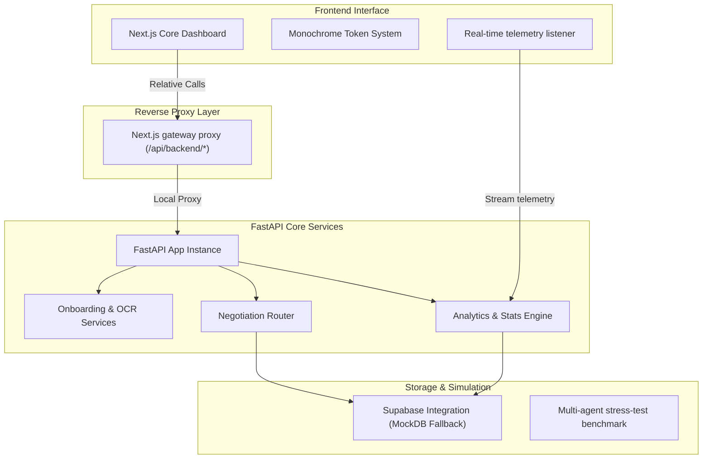

```
┌──────────────────────────────────────────────────────────────┐
│  ██████╗   █████╗   ██████╗  ████████╗                       │
│  ██╔══██╗ ██╔══██╗ ██╔════╝  ╚══██╔══╝                       │
│  ██████╔╝ ███████║ ██║          ██║                          │
│  ██╔═══╝  ██╔══██║ ██║          ██║                          │
│  ██║      ██║  ██║ ╚██████╗     ██║                          │
│  ╚═╝      ╚═╝  ╚═╝  ╚═════╝     ╚═╝                          │
│                                                              │
│  AUTONOMOUS B2B NEGOTIATION MARKETPLACE INTERFACE            │
│  Proprietary System Architecture • Operational Dashboard     │
└──────────────────────────────────────────────────────────────┘
```

# PACT — Autonomous Negotiation Marketplace

PACT is a proprietary, high-performance autonomous Agent-to-Agent (A2A) B2B negotiation marketplace. The platform enables automated contract and price negotiations for B2B transactions at enterprise scale, utilizing a zero-LLM-cost strategic negotiation framework to achieve sub-second execution latencies.

This repository contains the **FastAPI Backend Services** and the high-fidelity **Next.js Frontend Dashboard** designed with the visual gravity of institutional trading terminals.

> [!IMPORTANT]
> **PROPRIETARY AND CONFIDENTIAL**  
> All source code, logic, and architectural designs contained within this repository are the sole intellectual property of B2B Negotiation Marketplace. Unauthorized copying, distribution, or execution of this software is strictly prohibited.

---

## ── System Architecture ──

The system isolates frontend visualization, high-speed negotiation execution, and backend services to ensure strict security and scalability:



---

## ── Key Engine Features ──

* **Strategic Negotiation Protocol**: Utilizes deterministic multi-round game-theoretic frameworks (SAO) for automated buyer-seller concessions.
* **Deterministic Seller Archetypes**: Supports six structured negotiation profiles (`boulware`, `conceder`, `tit_for_tat`, `hardball`, `aspirational`, and `realistic`).
* **Multi-Criteria Evaluation**: Evaluates prospective contracts dynamically across five operational dimensions (Price, Delivery, Quality, Reputation, and Payment).
* **Targeted LLM Orchestration**: Restricts LLMs strictly to out-of-band, initial natural language constraint extraction to preserve lightning-fast core execution speeds.

---

## ── Repository Structure ──

```filepath
PACT/
├── api/                  # FastAPI Backend application
│   ├── models/           # Pydantic schemas and request/response models
│   ├── routers/          # Route handlers (onboarding, negotiation, stats)
│   ├── services/         # Core business logic (SAO, invoice parsing, LLM router)
│   └── main.py           # FastAPI entrypoint, middlewares, and CORS
├── dashboard/            # Next.js Frontend dashboard
│   ├── src/              # React pages, components, & custom theme hooks
│   ├── package.json      # Node package configuration & scripts
│   └── next.config.ts    # Frontend routing & relative backend reverse proxy
├── db/                   # Database schemas and connections
│   ├── schema.sql        # Supabase database initialization schemas
│   └── supabase_client.py# Supabase API client (falls back to MockDB)
├── simulation/           # Simulation and stress testing engine
│   ├── agents/           # Specialized SAO buyer/seller agent classes
│   ├── reports/          # Automatically generated stress-test reports (Excel/JSON)
│   └── stress_test.py    # Main multi-agent high-throughput simulation script
├── static/               # Static builds served directly by backend
├── .env.example          # Environment variables template
├── .gitignore            # Root-level git exclusions for clean commits
└── requirements.txt      # Python dependencies list
```

---

## ── Getting Started ──

### Prerequisites
* **Python**: Version `3.10` or higher
* **Node.js**: Version `18` or higher
* **Ollama (Optional)**: For local, offline constraint extraction.

---

### Step 1: Configure Environment Variables
Copy `.env.example` to `.env` at the root directory:
```bash
copy .env.example .env
```
Fill in your credentials (Supabase, Razorpay, Anthropic) if running in live mode. When left blank, the platform automatically enters a full **high-fidelity Mock/Stub mode** (offline-first, no external dependencies required).

---

### Step 2: Run the FastAPI Backend
Initialize a virtual environment, install dependencies, and launch the Uvicorn server:
```bash
# Create and activate virtual environment
py -m venv .venv
.venv\Scripts\activate

# Install requirements
pip install -r requirements.txt

# Start backend (runs on http://localhost:8000)
uvicorn api.main:app --reload --port 8000
```
Check health:
```bash
curl http://localhost:8000/health
```

---

### Step 3: Run the Next.js Frontend
In a new terminal, navigate to the `dashboard` directory, install dependencies, and run the Next.js dev server:
```bash
cd dashboard
npm install
npm run dev
```
Open [http://localhost:3000](http://localhost:3000) to view the real-time operational dashboard.

---

### Step 4: Run High-Throughput Stress Tests
To execute the multi-agent negotiation simulation engine in headless/benchmark mode, run:
```bash
py simulation/stress_test.py --buyers 5 --seed 42 --no-llm
```
This runs a simulated negotiation involving thousands of buyers and sellers, scoring results instantly and rendering tabular summaries.
